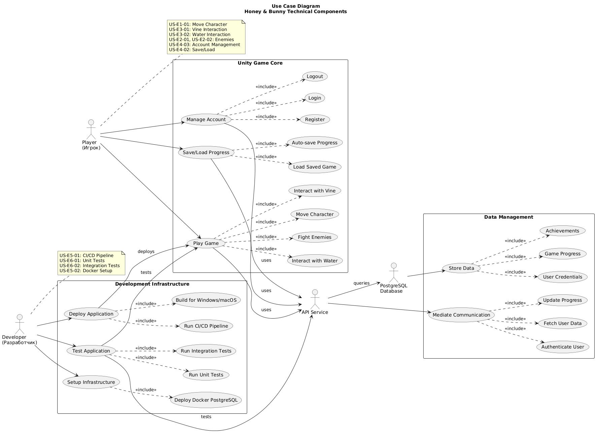

# Features & Requirements

## Epics Overview

| Epic | Description | Stories | Status |
|------|-------------|---------|--------|
| E1  | Game core development: development of basic game logic for agents, game mechanics, and connection to a remote database: FSM, simulation of ropes, and user interface | US-E1-01, US-E1-02,US-E1-03,US-E1-04 | ✅ |
| E2  | Autonomous Agents: Implementation of autonomous agents using FSM/HFSM and decision-making system via Blackboard | US-E2-01, US-E2-02, US-E2-03 | ✅     |
| E3  | Physics Simulation: Implementation of ropes and dynamic water surface simulation with realistic physics | US-E3-01, US-E3-02 | ✅    |
| E4  | Database Integration: Creation and integration of a remote PostgreSQL database via API for storing user data | US-E4-01, US-E4-02, US-E4-03 | ✅  |
| E5  | CI/CD & Containerization: Setting up automated build, test, and deployment using GitHub Actions and Docker | US-E5-01, US-E5-02 | ✅  |
| E6  | Automated Testing: Implementation of unit and integration tests with ≥70% coverage | US-E6-01 | ✅  |
| E7  | API Service: Creation and implementation of REST API for connecting the game to the database | US-E7-01 | ✅  |

## User Stories

# Epic 1: Game Core Development
Development of basic game logic for game mechanics, and connection to a remote database, including FSM-based AI, simulation of ropes/vines, and user interface.

| ID        | User Story                                                                 | Acceptance Criteria                                                                                                                         | Priority  | Status |
|-----------|----------------------------------------------------------------------------|--------------------------------------------------------------------------------------------------------------------------------------------|-----------|--------|
| US-E1-01  | As a player, I want to control my character's movement and interact with environmental objects, so that I can explore the game world, overcome obstacles, and complete challenges | - Character responds smoothly using implemented control keys to new mechanics  -Basic collision detection works correctly - Control system works via implemented keys | Must  | ✅ |
| US-E1-02  | As a player, I want to see my profile information, progress, and game status through an intuitive UI, so that I can track my advancement and make informed decisions | - Interface displays current player profile information (statistics, achievements) in real-time - Progress indicators (level completion, collected items) update correctly - Game status (health, energy, or similar metrics) is visible at all times - UI is responsive and does not block gameplay controls - Menus open/close correctly and buttons respond within ≤100 ms - UI does not overlap critical game objects or obstruct visibility | Must  | ✅     |
| US-E1-03  | As a player, I want realistic rope/vine physics, so that I can interact with swinging objects and obstacles naturally | - Ropes/vines respond to physics forces correctly - Player can grab and tug ropes without glitches - Collisions with ropes/vines behave realistically | Must  | ✅  |
| US-E1-04  | As a developer, I want the game client to communicate with a remote PostgreSQL database via API, so that player progress and game data are saved and loaded correctly | - Game state is sent and retrieved through REST API - Database stores player progress, scores, and settings - API responds within ≤800 ms - System handles failed requests gracefully | Must  | ✅ |

# Epic 2: Autonomous Agents
Implementation of intelligent agents with FSM/HFSM for dynamic gameplay.

| ID        | User Story                                                                 | Acceptance Criteria                                                                                                                         | Priority  | Status |
|-----------|----------------------------------------------------------------------------|--------------------------------------------------------------------------------------------------------------------------------------------|-----------|--------|
| US-E2-01  | As a game designer, I want each enemy to exhibit state-based behavior (patrol, chase, attack), so that their actions are predictable yet dynamic, creating engaging gameplay challenges | - Each enemy switches correctly between states (Idle → Patrol → Chase → Attack) - Enemy detects player within vision range - Attack occurs only within attack range - FSM does not loop infinitely| Must  | ✅     |
| US-E2-02  | As a player, I want the boss to exhibit complex, multi-phase behavior, so that the battle feels challenging, unpredictable, and rewarding | - Boss transitions correctly between phases when HP thresholds are reached - Blackboard updates on phase change, notifying minions - HFSM does not create logical conflicts or infinite loops | Must  | ✅     |
| US-E2-03  | As a developer, I want all agents to share information through a centralized blackboard system, so that their behavior can be coordinated and parameters easily adjusted | - Blackboard accessible from any script via Singleton pattern - Parameters update without delay - Agents react to Blackboard changes within 0.3 seconds - Subscription system notifies only relevant agents | Must  | ✅     |

# Epic 3: Physics Simulation
Creating realistic physics simulations to enhance game immersion.

| ID        | User Story                                                                 | Acceptance Criteria                                                                                                                         | Priority  | Status |
|-----------|----------------------------------------------------------------------------|--------------------------------------------------------------------------------------------------------------------------------------------|-----------|--------|
| US-E3-01  | As a player, I want to interact with a dynamically swaying vine that responds to my movements, so that gameplay feels realistic and immersive | - Vine returns to original position within 3 seconds after release - Simulation with 2 vines simultaneously does not drop FPS below 45 - No physics artifacts (jitter, sinking through colliders) | Should  | ✅     |
| US-E3-02  | As a player, I want water to react realistically to movements and floating objects, so that the environment feels alive and interactive | - Waves form within a 2-unit radius of interaction - Objects float on water surface with correct physics - Simulation runs ≥30 FPS during active interaction - Water surface produces no visual artifacts | Should | ❌     |

# Epic 4: Database Integration
Integration of a remote PostgreSQL database to save player progress.

| ID        | User Story                                                                 | Acceptance Criteria                                                                                                                         | Priority  | Status |
|-----------|----------------------------------------------------------------------------|--------------------------------------------------------------------------------------------------------------------------------------------|-----------|--------|
| US-E4-01  | As a developer, I want to establish a stable connection between Unity and a remote PostgreSQL database via REST API, so that user progress can be saved and synchronized across devices | - API connection established within ≤10 seconds with internet - Successful authentication returns JWT token stored locally - API requests timeout ≤800 ms - Connection errors handled and displayed to user - API endpoints covered by tests ≥80% | Must  | ✅     |
| US-E4-02  | As a player, I want my progress to be automatically saved and restored, so that I can continue playing from where I left off without losing achievements | - Auto-save occurs at level completion - Sync with DB occurs on requst per buttons - Game works offline using local saves but not saving it later to database | Must  | ✅     |
| US-E4-03  | As a player, I want to create an account and log in securely, so that my progress is tied to my identity and accessible from different devices | - Registration creates a new user in DB within ≤8 seconds - Login returns JWT token valid for 24 hours - Field validation shows errors in real-time - Password transmitted encrypted | Must  | ✅     |

# Epic 5: CI/CD & Containerization
Automating build, test, and deployment processes.

| ID        | User Story                                                                 | Acceptance Criteria                                                                                                                         | Priority  | Status |
|-----------|----------------------------------------------------------------------------|--------------------------------------------------------------------------------------------------------------------------------------------|-----------|--------|
| US-E5-01  | As a developer, I want each commit to dev and main branch to trigger automated build and tests, so that bugs are detected early and deployment is consistent in my API | - Pipeline starts automatically on push to dev or main, or via pull reuqest - Deploy to Render completes after passing all tests and lint check ≤10 min - All tests (≥80% coverage) pass before deployment - Developer notified with logs if build fails | Should  | ✅     |
| US-E5-02  | As a developer, I want to run PostgreSQL and API in a Docker container, so that I can test database interactions locally without external dependencies | - Container starts via `docker-compose up -d` within ≤3 min - PostgreSQL accessible on localhost:5432 after start - Initialization script creates tables automatically -Api accessible on localhost:8080 after start - Data persists between container restarts - Unity connects to local DB using API | Should  | ✅     |

# Epic 6: Automated Testing
Ensuring code quality through automated testing.

| ID        | User Story                                                                 | Acceptance Criteria                                                                                                                         | Priority  | Status |
|-----------|----------------------------------------------------------------------------|--------------------------------------------------------------------------------------------------------------------------------------------|-----------|--------|
| US-E6-01  | As a developer, I want to cover critical API logic with unit tests, so that bugs are detected early and code quality is maintained | - Test coverage ≥70% of codebase - All tests pass locally and in CI/CD - Test results reproducible - Failed tests block deployment | Must | ✅     |

# Epic 7: API Service
Creating a backend service for game-database interaction.

| ID        | User Story                                                                 | Acceptance Criteria                                                                                                                         | Priority  | Status |
|-----------|----------------------------------------------------------------------------|--------------------------------------------------------------------------------------------------------------------------------------------|-----------|--------|
| US-E7-01  | As a developer, I want to create a secure and relevant API service for the game, so that Unity can interact with the database to save and retrieve user data | - API endpoints respond within ≤800 ms under normal load when API is started - Authentication endpoints issue JWT tokens valid for 24 hours - Save and retrieve progress works correctly for multiple users - All endpoints return appropriate HTTP status codes for errors (4xx, 5xx) - API covered by unit and integration tests ≥80% - API documented (Swagger/OpenAPI) | Must  | ✅     |

## Use Case Diagram

## Non-Functional Requirements

### Performance

| Requirement          | Target                               | Measurement Method          |
|---------------------|-------------------------------------|-----------------------------|
| FPS                  | ≥45                                  | In Unity testing           |
| UI response time     | ≤100 ms                              | Input & UI interaction tests|
| API response time    | < 800 ms                             | Postman/manual API call     |
| Scene loading time   | ≤5 seconds                           | Manual test in Unity          |
| Game save/load time  | ≤500 ms                              | Automated unit tests            |
| Agent AI stability   | No deadlocks or infinite loops       | Playtesting  |
| Cross-platform support | Works correctly on Windows and macOS | Functional testing on both platforms |

### Security

- Authentication: JWT tokens with 24-hour expiration
- Authorization: Secure user authentication and access to personal game data
- Authorization: Certain API endpoints require a team-only password for access, ensuring that only authorized developers can perform administrative or sensitive actions.
- Data encryption: HTTPS for all data in transit; passwords stored hashed
- Input validation: Sanitize and validate all user input

### Accessibility

- Specific accessibility features: Keyboard navigation, tooltips for new players

### Reliability

| Metric             | Target                              |
|-------------------|-------------------------------------|
| Uptime             | Limited by free Render hosting: server may be spun down after ~15 minutes of inactivity, leading to temporary unavailability |
| Recovery time | >5 minutes for server to wake from sleep (free hosting limitation)      |
| Data backup        | Free Postgres databases do not support automated backups; manual backups (database dumps) can be performed by the development team monthly.  |
| Free instance hours for deployed API | 750 free instance hours per month for API; server may be suspended if hours are exceeded. |
| Error handling     | No crashes on database loss; graceful degradation to offline mode |

### Scalability

- Ability to add new agents, levels, and game mechanics without changing core architecture

### Compatibility
| OS | Minimum Version |
|------------------|-----------------|
| Windows | 10 |
| MacOS | 12 |

