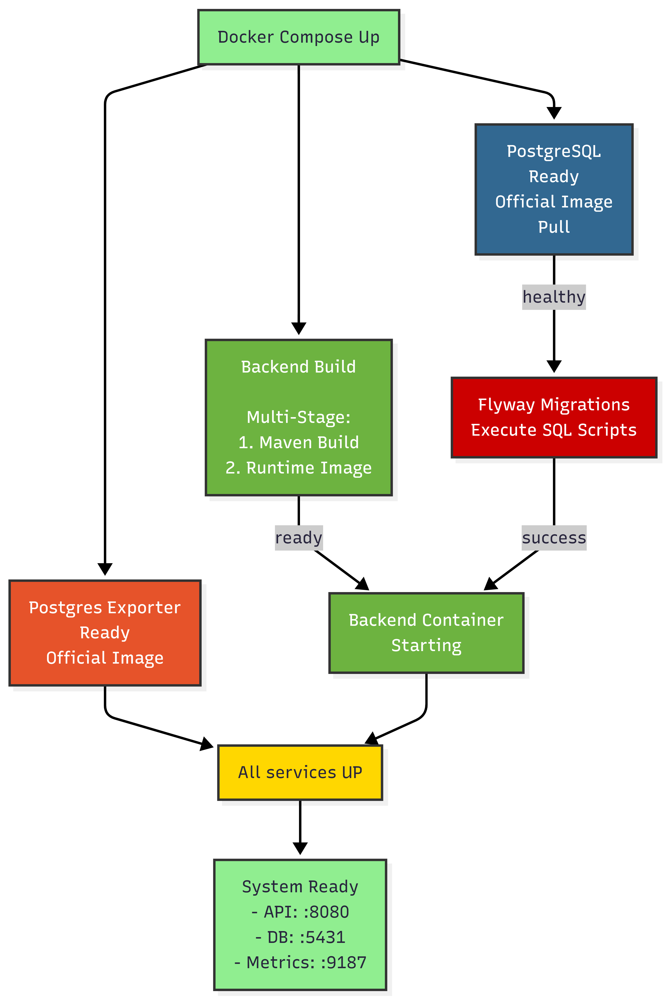

# Criterion: Containerization

## Architecture Decision Record

### Status

**Status:** Accepted 

**Date:** 2026-01-06

### Context

Containerization is used to provide a stable, isolated, and reproducible environment for the game backend and database, avoiding manual setup on each developer machine.
​
Key forces: team development, fast onboarding, minimizing environment‑related bugs, and enabling easy local startup of the entire stack.

### Decision

The system uses Docker and Docker Compose to containerize all core components: PostgreSQL, Flyway migrations, Postgres Exporter, and the Spring Boot backend.
​
The infrastructure is started with a single command, with health checks, resource limits, named volumes, and explicit dependencies.

### Alternatives Considered

| Alternative                                             | Pros                                              | Cons                                                                           | Why Not Chosen                                                                                  |
| ------------------------------------------------------- | ------------------------------------------------- | ------------------------------------------------------------------------------ | ----------------------------------------------------------------------------------------------- |
| Local DB and backend without Docker                     | Simple, fewer abstraction layers                  | Inconsistent environments, complex onboarding, manual DB setup                 | Does not meet reproducibility and fast team setup requirements |
| Single container with DB + backend                      | Simple deployment model, one image                | Poor isolation, hard scaling, harder independent updates                       | Violates separation of concerns and complicates maintenance   |

### Consequences

**Positive:**
- Fast, one-command startup of the entire infrastructure with an identical environment for all developers.
- Improved maintainability due to clear separation of components into dedicated containers with well-defined roles and dependencies.
- Built-in observability through Postgres Exporter and Spring Boot Actuator health checks for performance and resource monitoring.

**Negative:**
- Increased total image size (hundreds of megabytes for backend and database images).
- Additional complexity when configuring Docker Compose, health checks, and resource limits.

## Implementation Details

### Project Structure

```
game-progress-api/
├── gameapi/
│    ├── Dockerfile
|    └──.dockerignore   
│
├── docker/
│   ├── docker-compose.yml
|   ├── .env
│   └── .env.example                     
```

### Key Implementation Decisions

| Decision                                                                                | Rationale                                                                                                   |
| --------------------------------------------------------------------------------------- | ----------------------------------------------------------------------------------------------------------- |
| Separate PostgreSQL, backend, Flyway, Postgres Exporter into individual containers      | Clear isolation, easier independent updates and scaling|
| Use multi‑stage Dockerfile for backend with eclipse-temurin:21-jdk-jammy → 21-jre-jammy | Reduced image size and use of LTS Java on a stable Ubuntu base   |
| Configure health checks and depends_on with service_healthy                             | Ensures PostgreSQL is ready before running migrations and starting backend  |

### Diagrams




## Requirements Checklist

| # | Requirement                                               | Status | Evidence/Notes                                                                                                                                         |
| - | --------------------------------------------------------- | ------ | ------------------------------------------------------------------------------------------------------------------------------------------------------ |
| 1 | Containerize backend and DB in a reproducible environment | ✅      | Described PostgreSQL and backend images, configuration and resources                          |
| 2 | Apply database migrations automatically                   | ✅      | Dedicated one‑shot Flyway container, started after PostgreSQL becomes healthy                                    |
| 3 | Provide DB monitoring via metrics export                  | ✅      | Postgres Exporter v0.15.0 exposing Prometheus‑formatted metrics on port 9187                                     |
| 4 | Optimize image sizes and startup time                     | ⚠️     | Multi‑stage backend and Alpine Flyway, but resulting sizes are still relatively large ​ |


## Known Limitations

| Limitation                                     | Impact                                                              | Potential Solution                                                                                                           |
| ---------------------------------------------- | ------------------------------------------------------------------- | ---------------------------------------------------------------------------------------------------------------------------- |
| Relatively large backend and Flyway images     | Longer first‑time pulls and higher disk usage                       | Further Dockerfile optimization, trimming dependencies, and considering slimmer base images |
