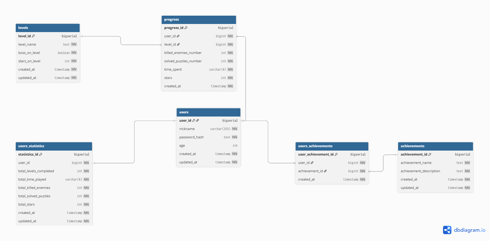

# Criterion: Database

## Architecture Decision Record

### Status

**Status:** Accepted 

**Date:** [2026-01-06]

### Context

The game progress tracking system requires a robust, relational database to store player accounts, level completion data, achievements, and aggregated statistics for a 2D platformer game. The database must support multiple concurrent players, maintain data integrity across related entities, handle transactional progress updates, and provide fast query performance for player statistics and leaderboards. All database interactions occur through a dedicated API layer, with no direct client access to the database.

### Decision

PostgreSQL was chosen as the relational database system with the following setup:

**Schema Design:**  
- Six core tables: users, levels, achievements, progress, users_achievements, users_statistics  
- Reference tables for game entities and transactional tables for player progress  
- Pre-computed `users_statistics` table for optimized queries  
- Indexed for performance

**Data Access Pattern:**  
- All operations via Spring Boot API  
- Single application role (`game_app`) with controlled privileges  
- Schema versioned with Flyway migrations  
- Automatic timestamps managed by database triggers

### Alternatives Considered

| Alternative     | Pros                                                                                                     | Cons                                                                                                                   | Why Not Chosen                                                                                                                                                          |
| --------------- | -------------------------------------------------------------------------------------------------------- | ---------------------------------------------------------------------------------------------------------------------- | ----------------------------------------------------------------------------------------------------------------------------------------------------------------------- |
| NoSQL (MongoDB) | Flexible schema for evolving game features, horizontal scaling, document-based storage matches game data | No ACID transactions across collections, complex relationship queries less efficient, weaker data integrity guarantees | Strict requirements for relationships between users, levels, and achievements demand adherence to ACID principles and referential integrity.    |
| SQLite          | Lightweight, serverless, simple deployment, good for single-user scenarios                               | Limited to local storage; does not support remote connections or multi-user access, which are required for team-shared database in this project | Remote database access for centralized player progress tracking is needed |
| MySQL           | Mature ecosystem, good performance, widely adopted                                                       | Weaker PostgreSQL standards compliance, less sophisticated constraint checking, limited JSON support                   | PostgreSQL offers superior data integrity features, better constraint validation, and extensibility for future requirements  |

# Consequences

## Positive

- Strong data integrity through foreign keys, check constraints, and triggers ensures reliable game progress tracking
- ACID transactions prevent data corruption during concurrent player operations
- Pre-computed statistics table enables fast leaderboard and analytics queries without expensive aggregations
- Comprehensive indexing strategy optimizes common query patterns 
- Flyway migrations provide version-controlled, repeatable schema changes suitable for ongoing game development
- Separation of concerns via API layer enhances security and enables database changes without client modifications

---

## Negative

- Time format stored as `VARCHAR(8)` instead of `INTERVAL` type requires application-level parsing and validation
- Pre-computed statistics require synchronization logic and introduce potential for temporary inconsistency
- PostgreSQL deployment requires more infrastructure setup compared to embedded databases

---

## Neutral

- Single application role simplifies the security model but requires careful API-level authorization
- Schema is optimized for the current game design and may require refactoring as game features expand


## Implementation Details

### Project Structure

```
game_progress_db/
├── db/
│   ├── scripts/
│   │   └── create_database.sql          # Initial database creation
│   ├── migration/                        # Flyway version-controlled migrations
│   │   ├── V1__create_role.sql          # Application role setup
│   │   ├── V2__create_users_table.sql
│   │   ├── V3__create_levels_table.sql
│   │   ├── V4__create_progress_table.sql
│   │   ├── V5__create_achievements_table.sql
│   │   ├── V6__create_users_achievements_table.sql
│   │   ├── V7__create_users_statistics_table.sql
│   │   ├── V8__create_triggers_update_updated_at.sql
│   │   └── V9__insert_reference_data.sql
│   └── seeds/                           # Test data scripts
|       ├── V10__test_data.sql
```

### Key Implementation Decisions

| Decision                                  | Rationale                                                                                                                                                   |
| ----------------------------------------- | ----------------------------------------------------------------------------------------------------------------------------------------------------------- |
| Bigserial IDs as primary keys                | Provides stable, immutable identifiers for all entities; auto-incrementing simplifies client logic           |
| Separate users_statistics table           | Pre-computed aggregates avoid expensive JOINs and COUNT queries for player profiles          |
| Composite indexes on foreign key pairs    | Optimizes queries filtering by user+level or user+achievement combinations common in game progress tracking     |
| VARCHAR time format with regex validation | Maintains human-readable format while enforcing HH:MM:SS structure through CHECK constraints                    |
| Cascade deletion on foreign keys          | Ensures referential integrity when users are deleted; automatically cleans up related progress and achievements |
| Unique constraints on business keys       | Prevents duplicate nicknames, level names, and achievement names; enforces one achievement per user and one statistics per user |
| Automatic updated_at triggers             | Eliminates application responsibility for timestamp management; ensures accurate audit trail|

### Diagrams



## Requirements Checklist

| #  | Requirement                                | Status | Evidence/Notes                                                                                                                                                   |
| -- | ------------------------------------------ | ------ | ---------------------------------------------------------------------------------------------------------------------------------------------------------------- |
| 1  | Relational database with normalized schema | ✅      | Six tables in 3NF with proper foreign key relationships                                                     |
| 2  | Data integrity via constraints             | ✅      | Primary keys, foreign keys, unique constraints, check constraints, and NOT NULL enforced on all tables              |
| 3  | Indexing for performance optimization      | ✅      | Eight indexes created: unique indexes on business keys, composite indexes on FK pairs, timestamp index for analytics​ |
| 4  | Transaction support (ACID compliance)      | ✅      | PostgreSQL native ACID support; all operations rolled back on constraint violations                             |
| 5  | User authentication data storage           | ✅      | Password hashes stored in users table; plaintext passwords never stored               |
| 6  | Schema version control                     | ✅      | Flyway migrations manage all DDL changes in versioned SQL files |                                            
| 7 | Automated timestamp management             | ✅      | Triggers automatically update updated_at field on all tables when records modified                        |
| 8 | Role-based access control                  | ✅      | game_app role created with SELECT, INSERT, UPDATE, DELETE privileges on all tables                          |


## Known Limitations

| Limitation                                         | Impact                                                                                                                                                                 | Potential Solution                                                                                       |
| -------------------------------------------------- | ---------------------------------------------------------------------------------------------------------------------------------------------------------------------- | -------------------------------------------------------------------------------------------------------- |
| Single application role lacks granular permissions | All API operations have same database privileges; cannot restrict specific endpoints at database level                                                                 | Implement multiple roles with specific privileges (read-only, write-only, admin) mapped to API endpoints |
| No soft delete mechanism                           | Deleted users permanently lose all progress data; cannot restore accidentally deleted accounts                                                                         | Add is_deleted flag to users table with filtered indexes; implement data retention policies              |
| Time format limited to 99:59:59                    | Cannot track sessions exceeding 99 hours (unlikely but theoretically possible for total_time_played)                  

## References
[Link to repository with database migrations](https://github.com/KatTihanovich/game_progress_db)
