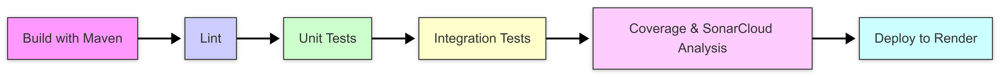

# Deployment & DevOps

## Infrastructure

### Deployment Architecture

```
┌──────────────────────────────────────────────────────────────┐
│                         Render Cloud                         │
├──────────────────────────────────────────────────────────────┤
│                                                              │
│   ┌─────────────────────────────────────────────┐            │
│   │           Backend API Service               │            │
│   │        (Java Spring Boot, Docker)           │            │
│   │                                             │            │
│   │  - REST API                                 │            │
│   │  - Authentication & validation              │            │
│   │  - Game progress persistence                │            │
│   │             Port: 8080                      │            │
│   │  Public HTTPS Endpoint                      │            │
│   └─────────────────────────────────────────────┘            │
│                     │                                        │
│                     ▼                                        │
│   ┌─────────────────────────────────────────────┐            │
│   │        PostgreSQL Database                  │            │
│   │                                             │            │
│   │  - Player profiles                          │            │
│   │  - Progress & statistics                    │            │
│   │  - Game-related data                        │            │
│   │             Port: 5432                      │            │
│   │  Internal network access                    │            │
│   └─────────────────────────────────────────────┘            │
│                                                              │
└──────────────────────────────────────────────────────────────┘
                             ▲
                             │ HTTPS (JSON)
                             │
┌──────────────────────────────────────────────────────────────┐
│                      Client Environment                      │
├──────────────────────────────────────────────────────────────┤
│                                                              │
│   ┌─────────────────────────────────────────────┐            │
│   │             Unity Game Client               │            │
│   │           (Windows / macOS)                 │            │
│   └─────────────────────────────────────────────┘            │
│                                                              │
└──────────────────────────────────────────────────────────────┘

```

### Game Backend API Environments

| Environment | URL | Branch |
|-------------|-----|--------|
| **Development** | http://localhost:8080 | `dev` |
| **Production** | https://game-progress-api.onrender.com | `main` |

## CI/CD Pipeline

### Pipeline Overview



### Pipeline Configuration

```yaml
name: Backend CI/CD

on:
  push:
    branches: [master, dev]
  pull_request:
    branches: [master, dev]
  workflow_dispatch:

jobs:
  build:
    runs-on: ubuntu-latest
    defaults:
      run:
        working-directory: gameApi
    steps:
      - uses: actions/checkout@v4
      - uses: ./.github/actions/maven-setup
      - name: Build with Maven
        run: ./mvnw clean package -DskipTests
      - name: Upload JAR artifact
        uses: actions/upload-artifact@v4
        with:
          name: gameapi-jar-${{ github.sha }}
          path: gameApi/target/*.jar
          retention-days: 7

  lint:
    runs-on: ubuntu-latest
    needs: build
    defaults:
      run:
        working-directory: gameApi
    steps:
      - uses: actions/checkout@v4
      - uses: ./.github/actions/maven-setup
      - name: Run Checkstyle
        run: ./mvnw checkstyle:check

  unit-tests:
    runs-on: ubuntu-latest
    needs: lint
    defaults:
      run:
        working-directory: gameApi
    steps:
      - uses: actions/checkout@v4
      - uses: ./.github/actions/maven-setup
      - name: Run unit tests (@Tag("unit"))
        run: ./mvnw test -Dgroups=unit
      - name: Upload unit test reports
        uses: actions/upload-artifact@v4
        with:
          name: unit-test-reports-${{ github.sha }}
          path: gameApi/target/surefire-reports/
          retention-days: 7

  integration-tests:
    runs-on: ubuntu-latest
    needs: unit-tests
    defaults:
      run:
        working-directory: gameApi
    steps:
      - uses: actions/checkout@v4
      - uses: ./.github/actions/maven-setup
      - name: Run integration tests (@Tag("integration"))
        run: ./mvnw test -Dgroups=integration
      - name: Upload integration test reports
        uses: actions/upload-artifact@v4
        with:
          name: integration-test-reports-${{ github.sha }}
          path: gameApi/target/surefire-reports/
          retention-days: 7

  coverage-and-sonar:
    name: JaCoCo coverage + SonarCloud
    runs-on: ubuntu-latest
    needs: integration-tests
    defaults:
      run:
        working-directory: gameApi
    steps:
      - uses: actions/checkout@v4
        with:
          fetch-depth: 0
      - uses: ./.github/actions/maven-setup
      - name: Run tests with coverage
        run: ./mvnw verify
      - name: SonarCloud Scan
        uses: SonarSource/sonarcloud-github-action@v3
        env:
          GITHUB_TOKEN: ${{ secrets.GITHUB_TOKEN }}
          SONAR_TOKEN: ${{ secrets.SONAR_TOKEN }}
        with:
          projectBaseDir: gameApi
          args: >
            -Dsonar.organization=kattihanovich
            -Dsonar.projectKey=KatTihanovich_game-progress-api
            -Dsonar.sources=src/main/java
            -Dsonar.tests=src/test/java
            -Dsonar.java.binaries=target/classes
            -Dsonar.junit.reportPaths=target/surefire-reports
            -Dsonar.coverage.jacoco.xmlReportPaths=target/site/jacoco/jacoco.xml
            -Dsonar.verbose=true
      - name: Upload full JaCoCo HTML report
        uses: actions/upload-artifact@v4
        with:
          name: jacoco-html-${{ github.sha }}
          path: gameApi/target/site/jacoco/
          retention-days: 7

  deploy:
    runs-on: ubuntu-latest
    needs: coverage-and-sonar
    if: github.ref == 'refs/heads/master'
    steps:
      - name: Trigger Render deploy
        run: curl -f -X POST ${{ secrets.RENDER_DEPLOY_HOOK_URL }}
      - name: Wait for service health
        run: |
          echo "Waiting for service health..."
          for i in {1..10}; do
            STATUS=$(curl -s -o /dev/null -w "%{http_code}" https://game-progress-api.onrender.com/actuator/health || echo "000")
            echo "Attempt $i: HTTP $STATUS"
            if [ "$STATUS" = "200" ]; then
              echo "Service is healthy."
              exit 0
            fi
            sleep 10
          done
          echo "Service did not become healthy in time."
          exit 1
```

## Environment Variables

| Variable | Description | Required | Used In | Example |
|---------|------------|----------|---------|---------|
| `DB_HOST` | Database host address | Yes | Runtime, Containerization | `localhost` |
| `POSTGRES_SUPERUSER` | PostgreSQL superuser name | Yes | Containerization | `postgres` |
| `POSTGRES_SUPERUSER_PASSWORD` | PostgreSQL superuser password | Yes | Containerization | `password_example` |
| `POSTGRES_DB` | Application database name | Yes | Runtime, Containerization | `game_progress_db` |
| `POSTGRES_USER` | Application database user | Yes | Runtime, Containerization | `app_user` |
| `GAME_APP_PASSWORD` | Application database user password | Yes | Runtime, Containerization | `password_example` |
| `BACKEND_PORT` | Backend application port | No | Runtime, Containerization | `8080` |
| `JWT_SECRET` | Secret key for JWT signing (HS256, ≥256 bits) | Yes | Runtime, Containerization | `your_jwt_secret`|
| `JWT_EXPIRATION` | JWT expiration time in milliseconds | No | Runtime, Containerization | `86400000` |
| `DB_MIGRATION_PATH` | Path to database migration scripts | No | Containerization | `path/to/db/migrations` |
| `DB_SEEDS_PATH` | Path to database seed scripts | No | Containerization | `path/to/db/seeds` |
| `ADMIN_PASSWORD` | Admin user password | Yes | Runtime, Containerization | `password_example` |

> **Note:**  
> Environment variables are grouped by usage to clearly distinguish where they are applied.  
> **Runtime** variables are used in the deployed application environment.  
> **Containerization** variables are used only for local development, container setup, and application startup via Docker.

**Secrets Management:** All enviroment variables are stored in .env file for containerization and local set up, and in GitHub Secrets and Render Environment Variables for deployment.

## How to Run Locally

This project is designed to be run locally **using Docker only**.  
No local Maven or database installation is required.

### Prerequisites

- [Docker](https://www.docker.com/)
- [Docker Compose](https://docs.docker.com/compose/)

---

### Local Setup (Docker)

#### 1. Clone repositories

Clone the API repository:

```bash
git clone https://github.com/KatTihanovich/game-progress-api
```

Clone the database repository:

```bash
git clone https://github.com/KatTihanovich/game_progress_db
```
#### 2. Set up environment variables
Create .env file and fill it using .env.example

#### 3. Navigate to docker-compose.yml
Navigate to the directory containing docker-compose.yml in game-progress-api repo:
```bash
cd path/to/api-repo/docker
```
#### 3. Set up containers
```bash
docker-compose up --build
```

### Verify Installation

After starting the server:

1. Open [http://localhost:8080/actuator/health](http://localhost:8080/actuator/health)
2. You should see  "status": "UP"
3. Open Swagger to test endpoints [http://localhost:8080/swagger-ui/index.html#/](http://localhost:8080/swagger-ui/index.html#/)
