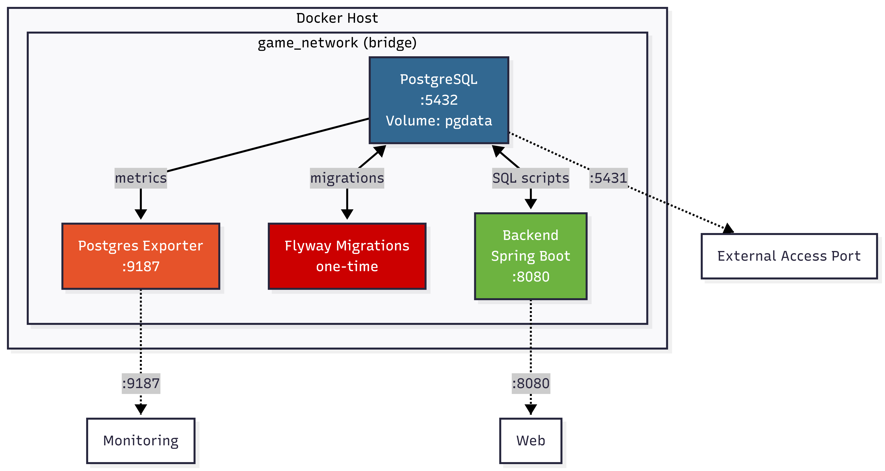

# Criterion: Containerization

## Architecture Decision Record

### Status
**Status:** Accepted  
**Date:** 2026-01-06

### Context
Containerization provides a stable, isolated, and reproducible environment for the backend and database, avoiding manual setup for developers.  
Key goals: team development, fast onboarding, minimizing environment-related bugs, easy local startup.

### Decision
Use **Docker and Docker Compose** to containerize:

* PostgreSQL  
* Flyway migrations  
* Postgres Exporter  
* Spring Boot backend  

Infrastructure starts with a single command, includes health checks, resource limits, named volumes, and dependencies.

### Alternatives Considered

| Alternative | Pros | Cons | Why Not Chosen |
|------------|------|------|----------------|
| Local DB + backend | Simple, fewer abstraction layers | Inconsistent environments, manual setup | Fails reproducibility and fast team setup goals |
| Single container (DB + backend) | One image, simple deployment | Poor isolation, harder scaling, maintenance | Violates separation of concerns, harder updates |

---

### Consequences

**Positive:**  
- Fast, one-command startup for consistent environment  
- Clear separation of components; easier maintenance  
- Observability via Postgres Exporter and Spring Boot health checks  

**Negative:**  
- Larger image sizes  
- Slightly more complex Docker Compose setup  

---

## Implementation Details

### Project Structure

```
game-progress-api/
├── gameapi/
│    ├── Dockerfile
|    └──.dockerignore   
│
├── docker/
│   ├── docker-compose.yml
|   ├── .env
│   └── .env.example                     
```

### Key Implementation Decisions

| Decision | Rationale |
|---------|-----------|
| Separate containers for PostgreSQL, backend, Flyway, Postgres Exporter | Clear isolation, easier updates and scaling |
| Multi-stage backend Dockerfile (eclipse-temurin:21-jdk-jammy → 21-jre-jammy) | Reduces image size, uses stable LTS Java |
| Health checks + `depends_on` with `service_healthy` | Ensures DB ready before migrations and backend start |

### Diagrams

  


---

## Requirements Checklist

| # | Requirement | Status | Notes |
|---|------------|--------|-------|
| 1 | Containerize backend + DB | ✅ | Images, configuration, resources defined |
| 2 | Apply DB migrations automatically | ✅ | Flyway container started after PostgreSQL is healthy |
| 3 | Provide DB monitoring | ✅ | Postgres Exporter v0.15.0 exposes Prometheus metrics (port 9187) |
| 4 | Optimize image size/startup time | ⚠️ | Multi-stage builds used, but images still relatively large |

---

## Known Limitations

| Limitation | Impact | Potential Solution |
|-----------|--------|------------------|
| Large backend and Flyway images | Longer pulls, higher disk usage | Further optimize Dockerfile, trim dependencies, use slimmer base images |
