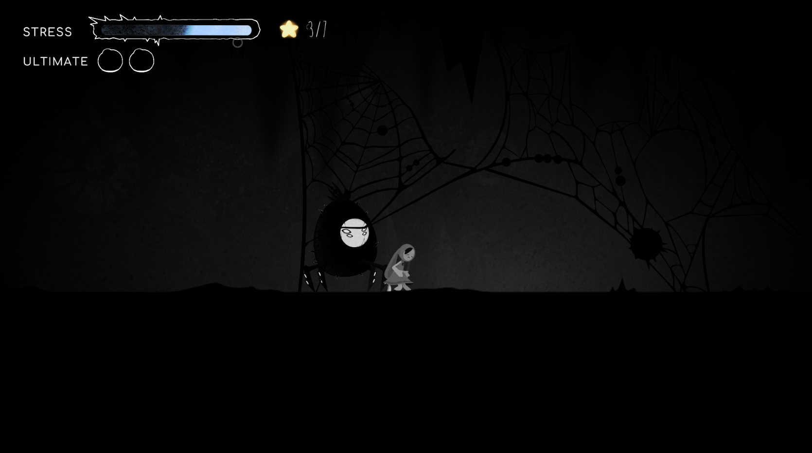
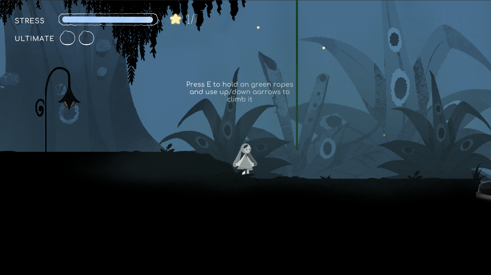
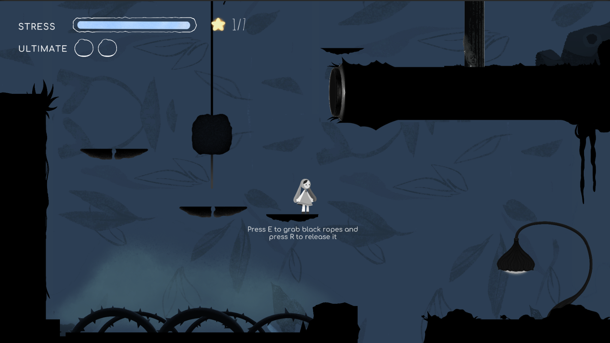

# Feature Walkthrough

## Feature 1: Guest Mode

### Overview

Allows players to start playing immediately without registration, focusing on quick access to gameplay.

### How to Use

**Step 1:** Launch the game
**Step 2:** Select Guest Mode on the screen with message
**Step 3:** Press button **Start Game**

Expected Result:
The game starts immediately and first level *Forest and Cave* is loaded, but progress and achievements are not saved.

Tips

### Tips

- Best option for quick testing or casual play
- Registration unlocks profile features and progress saving

---

## Feature 2: User Registration & Profile

### Overview

Provides persistent progress, achievements, and access to user-specific information.
### How to Use

**Step 1:** Select Register / Login on launch

**Step 2:** Complete registration or login

**Step 3:** Open User Profile Window pressing **User profile** button
**Step 4:** Play the game

**Expected Result:** User will find their own achievements and statistics in User Profile Window, also on Slecting Level Window there will be displayed latest progress for each level. Also after completing a level progress on it, user statistics and possibly achievements(if the condition is met) will be updated.

---

## Feature 3: Autonoumous agent enemies

### Overview

Enemies act autonomously using state-based behavior, reacting to the player and the environment.
### How to Use

**Step 1:** Enter a level

**Step 2:** Interact with any enemy from the screenshots( fight them pressing F key)

**Step 3:** Observe different behavior patterns per enemy type.

**Expected Result:** Enemies switch between states such as idle, patrol, attack, and unique behaviors depending on type. Player can fight or be attacked. In this case character can die or can kill the enemy.

---

## Feature 4: Rope Interaction Mechanics

### Overview

Ropes expand gameplay mechanics by enabling traversal, interaction, and puzzle-solving.

## Different ropes screenshots examples:

### How to Use

**Step 1:** Enter level

**Step 2:** Find rope
- Based on its colour there are two ways to use them: black ropes with stone on it are used for puzzle with button and green ropes are used for climbing

**Step 3:** Interact with rope according for tutorial hint based on its coulour

**Expected Result:** Overall player should complete and go further on the level. The player must use the rope to  move forward: 
- Climb onto the ledge
- Activate the button 

---

## Keyboard Shortcuts

| Shortcut | Action |
|----------|--------|
| A/D| RLeft/Right Movement |
| W/S | Look up/down |
| E | Interaction with objects |
| F | Attack |
| Space | Jumping; Douhble jump if pressed twice|
| Q | Ultimate attack(needs to be charged by enemy killing)|
|Arrow UP/Down| Climbing|
| R | Release grabbed rope|
