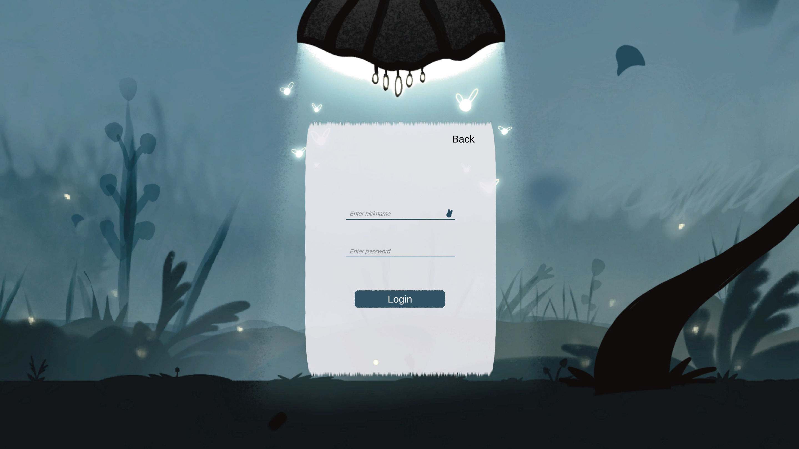
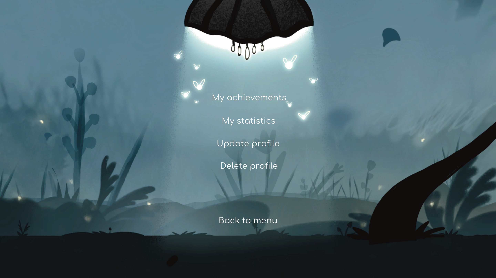

# 3. User Guide

This section provides instructions for end users on how to use the application.

## Contents

- [Features Walkthrough](features.md)
- [FAQ & Troubleshooting](faq.md)

## Getting Started

### System Requirements

| Requirement | Minimum | Recommended |
|-------------|---------|-------------|
| OS | Windows 10, MacOS 12 | Latest version |
| **Internet** | Optional | Required to use all features |
| **Device** | Desktop | - |

### Accessing the Application

1. Download Honey&Bunny.zip file from Google drive: *https://drive.google.com/drive/folders/1FcrTtvB9ld8SgPrPzfXIo3fRa0ILy2A4?usp=drive_link*
2. Extract the archive
3. Open HoneyAndBunny.exe

#### Step 1: Choose Game Mode

When launching the game, you will see a window asking you to choose how you want to play:

1. Select **Guest Mode** to play immediately without registration  
2. Select **Register / Login** to access user-related features (profile, saved progress)

---

#### Step 2A: Guest Mode (Optional Path)

If **Guest Mode** is selected:

1. You are taken directly to the **Main Menu**
2. You can:
   - Start a new game
   - Select a level
3. Progress and achievements are **not saved** in guest mode

---

#### Step 2B: Registration / Login (Optional Path)

If **Register / Login** is selected:

1. Choose **Register** to create a new account or **Login** if you already have one  
2. Complete the registration or login form  
3. Wait for confirmation that the operation was successful  

After successful authentication, you are redirected to the **Main Menu**

---

#### Step 3: Main Menu

From the main menu, you can:

- **Start Game** — begin gameplay  
- **Select Level** — choose an available level  
- **User Profile** *(registered users only)* — view profile-related information
- **Settings** — volume level adjustment and controls info
- **Exit Game** — close the application  

If User Profile button pressed you'll see window with user features

#### Step 4: Play
After pressing **Start Game** you'll appear on level with controls hints as tutorial. Now you can play the game.

## Quick Start Guide

| Task | How To |
|------|--------|
| Start playing immediately | Launch the game, choose **Guest Mode**, and proceed to the main menu |
| Begin gameplay | In the main menu, press **Start Game** |
